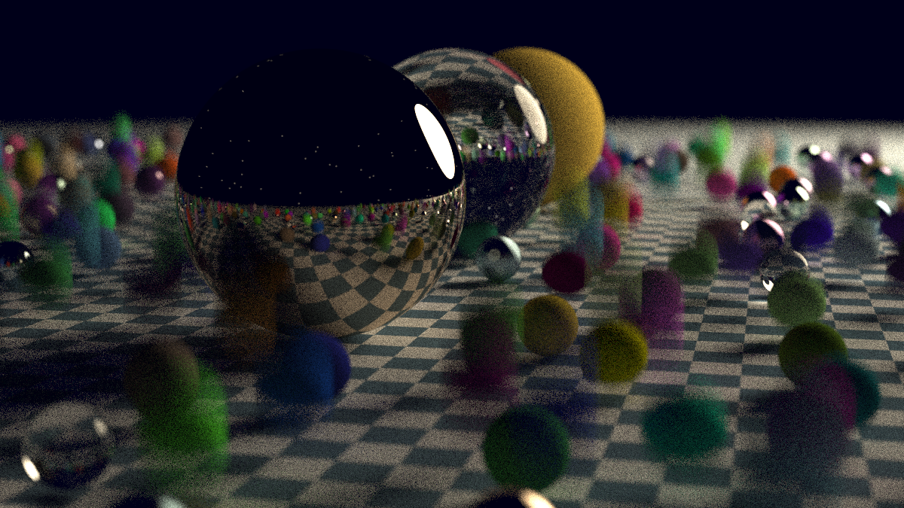
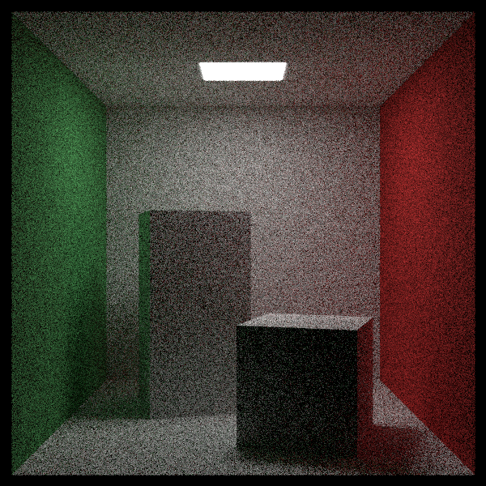
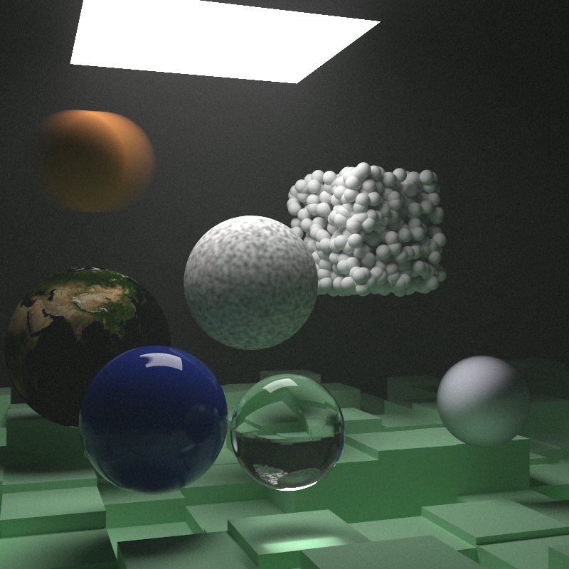

# CPU Ray Tracing Engine (C++)

A single-threaded, CPU-based path tracing system designed as a foundational rendering
engine for exploring physically based light transport, acceleration structures, and
volumetric rendering. The current implementation emphasizes correctness, clarity, and
system architecture, serving as a base for future extensions into performance-oriented
and hardware-accelerated rendering.

---

## System Overview

This project is a CPU-based, offline ray tracing system focused on correctness and
architectural clarity rather than real-time performance. It is designed as an
exploration of core rendering concepts such as geometry, materials, acceleration
structures, and volumetric light transport.

The current implementation does not target real-time rendering, GPU acceleration,
or production-level performance, and instead serves as a foundation for incremental
extension and experimentation.

---

## Capabilities (v1.0)

### Rendering
- Recursive path tracing with configurable maximum depth
- Monte Carlo sampling with multiple samples per pixel
- Gamma-correct output

### Geometry
- Static and moving spheres
- Arbitrary quadrilaterals
- Axis-aligned boxes
- Hierarchical scene composition via hittable abstractions
- Support for nested volumetric boundaries

### Materials
- Lambertian diffuse reflection
- Metallic reflection with controllable roughness
- Dielectric materials with refraction and total internal reflection
- Emissive materials for area light sources

### Textures
- Solid color textures
- Image-based textures (stb_image)
- Procedural Perlin noise
- Turbulence and marble-style procedural textures

### Volumetrics
- Constant-density participating media
- Isotropic scattering
- Volumetric absorption
- Nested volumetric regions

### Acceleration Structures
- Bounding Volume Hierarchy (BVH)
- Axis-aligned bounding boxes (AABB)

---

## Example Renders

## Example Renders

The following renders are selected to validate correctness across core rendering
features and scene complexity, rather than visual styling.

---

### 1. Core Path Tracing, Motion Blur & Texturing

Validation of recursive path tracing with diffuse, metallic, and dielectric materials,
including textured geometry and motion blur via time-varying primitives. The scene
demonstrates correct handling of moving objects, texture mapping, and stochastic
sampling.

---

### 2. Global Illumination & Area Lighting

Cornell box scene illustrating indirect illumination, soft shadows, and color
bleeding from an emissive area light source, validating global illumination behavior
and geometric correctness.

---

### 3. Scene Complexity & Volumetric Rendering

Complex scene composition incorporating bounding volume hierarchies, heterogeneous
materials, and constant-density volumetric media. This render demonstrates
participating media, isotropic scattering, and nested volumetric regions.

## Build & Run

### Requirements

- C++17-compatible compiler (clang++ or g++)
- Unix-like environment (macOS or Linux)

### Build

clang++ -std=c++17 -Iinclude src/main.cpp -o raytracer

### Run

./raytracer > output.ppm

Note: Rendering may take significant time depending on scene complexity and sampling parameters.

---

## Repository Structure

src/ - Application entry point and implementation code
include/ - Core rendering abstractions and interfaces
assets/ - Runtime assets (e.g. textures)
docs/ - Documentation and curated render outputs
external/ - Third-party dependencies (stb_image)

---

## Learning Lineage

This project draws from the concepts and techniques presented in Peter Shirley’s
*Ray Tracing in One Weekend* series. The focus of this implementation is on deeply
engaging with the underlying rendering principles and organizing them into a
coherent, extensible system that can serve as a base for further exploration.

---

## Roadmap

Planned areas of exploration include:
- Deterministic random sampling and reproducible renders
- Multithreaded CPU rendering
- Architectural refactoring for clearer renderer/core separation
- Sampling improvements and variance reduction
- Exploration of hardware-accelerated and GPU-based backends
