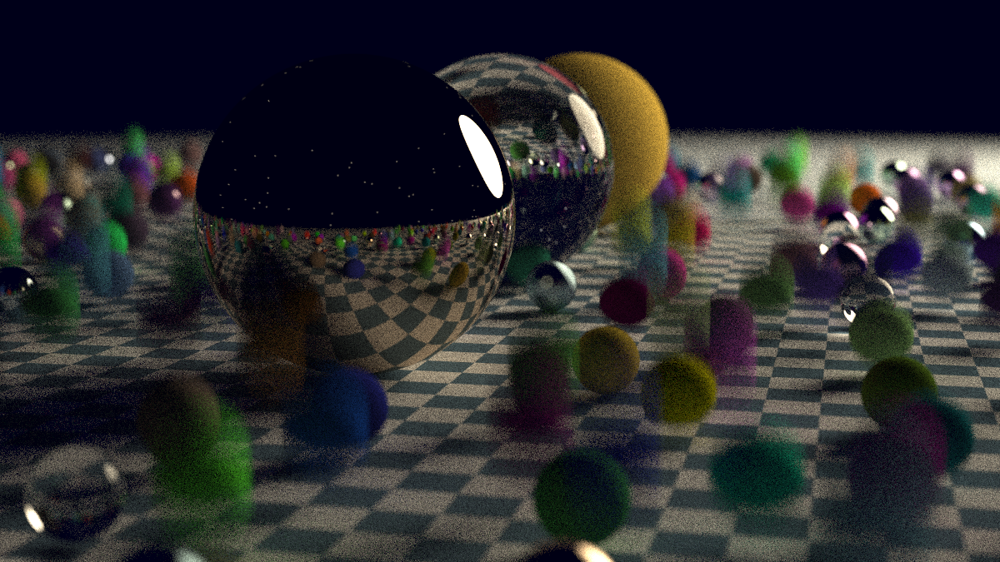
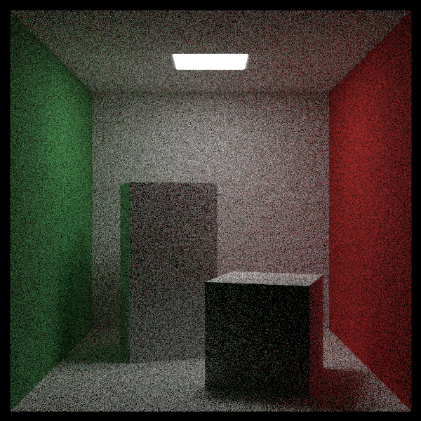
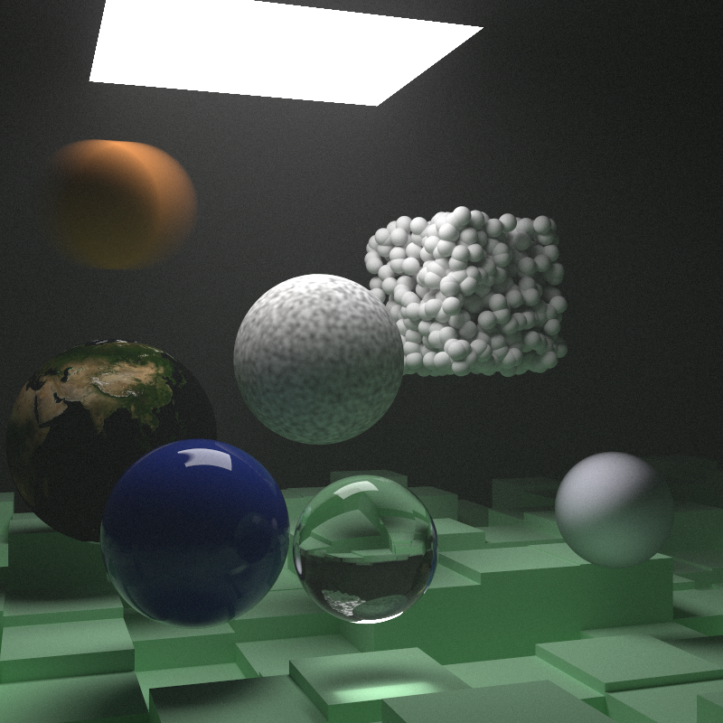

# CPU Multithreaded Ray Tracing Engine (C++)

A CPU-based, multithreaded ray tracing system designed as a foundational rendering engine
for exploring physically based light transport, acceleration structures, volumetric
light transport, and parallel execution on modern multi-core processors. The current
implementation emphasizes correctness, architectural clarity, and a framebuffer-first,
tile-based rendering pipeline, serving as a base for future extensions into
hardware-accelerated and backend-specific rendering pipelines.

---

## System Overview

This renderer initially used a scanline-based, single-threaded execution model,
writing pixel results directly to the output stream. While suitable for early
correctness validation, this approach limited scalability and made performance
analysis and backend extensibility difficult.

**The current architecture adopts a framebuffer-first rendering pipeline with tile-based
work decomposition. The image is divided into fixed-size tiles, which are dynamically
scheduled across a pool of CPU worker threads using atomic work distribution. Each tile
is rendered independently into a shared framebuffer, followed by a final output pass.**

**This structural shift improves CPU utilization, enables deterministic and progressive
rendering strategies, simplifies profiling and instrumentation, and establishes a clean
execution model that can be extended toward alternative backends such as GPU-accelerated
or hardware-specific rendering pipelines.**

---

## Determinism

The renderer supports a deterministic execution mode in which identical inputs produce bitwise-identical output, independent of thread count or scheduling order, enabling debugging, benchmarking, and GPU parity.

Determinism is achieved through:
- Explicit per-pixel, per-sample RNG seeding
- Elimination of global randomness during rendering
- Deterministic motion blur time sampling and volumetric scattering
- Thread-safe, order-independent accumulation

---

## Capabilities

### Rendering
- Recursive path tracing with configurable maximum depth
- Monte Carlo sampling with multiple samples per pixel
- Gamma-correct output
- Deterministic and non-deterministic execution modes

### Geometry
- Static and moving spheres
- Arbitrary quadrilaterals
- Axis-aligned boxes
- Hierarchical scene composition via hittable abstractions
- Support for nested volumetric boundaries

### Materials
- Lambertian diffuse reflection
- Metallic reflection with controllable roughness
- Dielectric materials with refraction and total internal reflection
- Emissive materials for area light sources

### Textures
- Solid color textures
- Image-based textures (stb_image)
- Procedural Perlin noise
- Turbulence and marble-style procedural textures

### Volumetrics
- Constant-density participating media
- Isotropic scattering
- Volumetric absorption
- Nested volumetric regions

### Acceleration Structures
- Bounding Volume Hierarchy (BVH)
- Axis-aligned bounding boxes (AABB)

---

## Example Renders

The following renders are selected to validate correctness across core rendering
features and scene complexity, rather than visual styling.

---

### 1. Core Ray Tracing, Motion Blur & Texturing



Validation of recursive path tracing with diffuse, metallic, and dielectric materials,
including textured geometry and motion blur via time-varying primitives. The scene
demonstrates correct handling of moving objects, texture mapping, and stochastic
sampling.

---

### 2. Global Illumination & Area Lighting



Cornell box scene illustrating indirect illumination, soft shadows, and color
bleeding from an emissive area light source, validating global illumination behavior
and geometric correctness.

---

### 3. Scene Complexity & Volumetric Rendering



Complex scene composition incorporating bounding volume hierarchies, heterogeneous
materials, and constant-density volumetric media. This render demonstrates
participating media, isotropic scattering, and nested volumetric regions.

---

## Execution Model Comparison

The render below was produced using identical scene configuration, camera parameters,
sampling settings, and maximum ray depth. The visual output is identical across execution
models; the difference lies entirely in how work is scheduled on the CPU.

<table align="center" border="2" cellpadding="10" cellspacing="0">
  <tr>
    <td colspan="3" align="center">
      
    </td>
  </tr>

  <tr>
    <th align="center">Execution Model</th>
    <th align="center">CPU Configuration</th>
    <th align="center">Render Time</th>
  </tr>

  <tr>
    <td align="center">Single-threaded</td>
    <td align="center">1 core (Apple M1)</td>
    <td align="center"><strong>565.59 s</strong></td>
  </tr>

  <tr>
    <td align="center">Tile-based multithreaded</td>
    <td align="center">4 cores (Apple M1)</td>
    <td align="center"><strong>187.04 s</strong></td>
  </tr>
</table>

This comparison isolates the impact of execution model and work decomposition on CPU
utilization, independent of shading, sampling, or scene complexity.

---

## Build & Run

### Requirements

```
- C++17-compatible compiler (clang++ or g++)
- Unix-like environment (macOS or Linux)
```
### Build
```
clang++ -std=c++17 -Iinclude src/main.cpp -o raytracer
```

### Run
```
./raytracer > output.ppm
```

Note: Rendering may take significant time depending on scene complexity and sampling parameters.

---

## Repository Structure
```
src/ - Application entry point and implementation code
include/ - Core rendering abstractions and interfaces
assets/ - Runtime assets (e.g. textures)
docs/ - Documentation and curated render outputs
external/ - Third-party dependencies (stb_image)
```

---

## Learning Lineage

This project draws from the concepts and techniques presented in Peter Shirley’s
*Ray Tracing in One Weekend* series. The focus of this implementation is on deeply
engaging with the underlying rendering principles and organizing them into a
coherent, extensible system that can serve as a base for further exploration.

---

## Roadmap

Planned areas of exploration include:
- Progressive rendering
- Performance profiling and optimization
- Tile scheduling strategies and cache behavior analysis
- Exploration of hardware-accelerated and GPU-based backends
